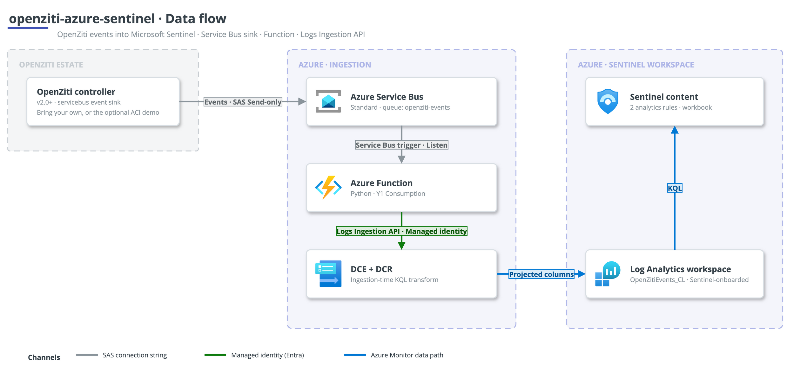

# Architecture

This deployment ships OpenZiti controller events into Microsoft Sentinel over a
push-based, PaaS-only pipeline. This page explains why it is shaped that way and
what each component is doing.

The failure modes hit while building and running this live in
[troubleshooting.md](troubleshooting.md).

## Why push-based

OpenZiti's controller emits a structured JSON event stream, but its event
handlers only write to a file, to stdout, to a generic AMQP 0-9-1 broker, or -
from v2.0 - to Azure Service Bus. There is no native syslog emitter and no
HTTPS push. That constraint drives the design:

- A file or stdout handler would need a host log agent (the Azure Monitor Agent)
  plus a Data Collection Rule reading a tailed file. That is more moving parts on
  the controller host and more assurance surface.
- The v2.0 `servicebus` sink lets the controller push events directly into a
  managed queue, with no host agent and no log-file plumbing. The queue also
  provides durable buffering: if the downstream Function is briefly unavailable
  (for example while a fresh role assignment propagates), events wait in the
  queue rather than being lost.
- Everything downstream of the controller is managed Azure PaaS, so there is no
  VM to patch in the ingestion path.

## Data flow

The controller's `servicebus` sink authenticates with a Send-only SAS rule and
writes JSON events to the `openziti-events` queue on a Service Bus Standard
namespace. An Azure Function (Python, Y1 Consumption) is triggered by the queue
over a Listen-only connection string, and forwards each event to the Azure
Monitor Logs Ingestion API using its system-assigned managed identity, which
holds **Monitoring Metrics Publisher** on the Data Collection Rule. The event
reaches the DCR through the Data Collection Endpoint, an ingestion-time KQL
transform projects the columns, and the row lands in the `OpenZitiEvents_CL`
custom table in Log Analytics. Two scheduled Sentinel analytics rules and a
workbook read from that table.

## Component rationale

### Service Bus

Standard tier is enough: the queue only needs plain queueing and durable
buffering, not the Premium features. Two separate SAS authorisation rules keep
least privilege on either side of the queue - a **Send-only** rule for the
controller and a **Listen-only** rule for the Function. The controller side
must be a SAS connection string because the OpenZiti `servicebus` sink has no
managed-identity path in the shipped code; it is the one unavoidable shared key
in the design.

### Function hosting

The Function runs on a **Y1 Consumption** plan. Flex Consumption was tried first
and, while it deployed and published cleanly, its host never actually executed
the worker - zero telemetry, and the queue never drained. Y1 consumed the queue
immediately. The Service Bus trigger uses a Listen connection string, not
managed identity, because the Consumption scale controller cannot peek the
queue over a managed identity to scale from zero. The Function's own upload to
the Logs Ingestion API still uses managed identity. The Functions runtime
storage (`AzureWebJobsStorage`) is a keyed connection string, so that storage
account keeps shared keys enabled.

### Ingestion design

The Function is a thin, schema-stable passthrough: it pulls the
event `timestamp` into `TimeGenerated` and puts the whole event object into a
`RawData` dynamic column, then uploads. All column projection lives in the DCR
transform, so the parsed schema can change with a DCR edit and no code change
or redeploy. The transform uses
`iif(isnotempty(tostring(x)), tostring(x), tostring(y))` rather than
`coalesce()`, because the ingestion-time KQL subset does not provide
`coalesce()`. That pattern is needed to reconcile OpenZiti's mixed casing: most
namespaces use `event_type` (snake_case) while `entityChange` uses `eventType`
(camelCase).

### Custom table

The `OpenZitiEvents_CL` table is created with the `azapi` provider, because
`azurerm` cannot create a Log Analytics custom table (its table resource only
manages plan and retention on tables that already exist).

### Demo controller on ACI

The self-contained demo runs a real OpenZiti v2.0 controller so the pipeline can
be proven end-to-end against genuine events. It runs on **Azure Container
Instances**, not a VM, for two reasons: it removes any VM dependency, and some
subscription offers restrict small VM SKUs entirely (see the troubleshooting
notes), which would block a VM-based demo outright.

Running the `ziti-controller` image on ACI has one sharp edge: its persistent
state cannot live directly on the Azure Files (CIFS) mount. ziti's PKI store
hard-links the intermediate CA bundle (`os.Link`), which CIFS does not support,
and the bbolt/raft database uses mmap, which is unsafe over CIFS. So bootstrap
runs on container-local disk, and only an identity snapshot (PKI + config) is
copied to the Azure Files share. The snapshot uses `cp -rL` (dereferencing the
hard links) and copies `config.yml` **last** - it is the sentinel the restore
branch keys on, so a half-written snapshot is retried rather than restored on the
next start. An `event-gen` sidecar makes one successful and one failed admin
login per minute against the edge management API, so real `authentication`
events (success and failure) flow with no routers and no data plane.

### Analytics rules

The two scheduled rules take their names from the per-deploy random suffix (for
example `openziti-auth-failure-spike-<suffix>`). Sentinel keys a rule's ID on its
name and holds a deleted ID in a cooldown, so suffixing the names means a
redeploy never collides with a just-deleted rule. Both rules `depends_on` the
custom table: they only reference the table inside a KQL string, not as a
resource, so without the explicit dependency Terraform would schedule them before
the table exists and Sentinel would reject the query.

## Targeting an existing workspace

With `create_workspace = false` and a `workspace_resource_id`, the pipeline
writes into an existing central Sentinel workspace instead of creating one.
Terraform then never creates, modifies, or destroys that workspace; it only
adds the custom table, DCE, DCR, analytics rules, and workbook. Two constraints
apply in this mode:

- **Retention.** The custom table's total retention must be >= the target
  workspace's retention, or the table create fails with a 400. Set
  `retention_in_days` to match or exceed the workspace.
- **Permissions.** Creating the DCR role assignment needs
  `Microsoft.Authorization/roleAssignments/write`, which Contributor does not
  include. Grant **User Access Administrator** or **Owner** on the scope
  alongside Contributor.

## Lifecycle

- **`deploy.sh`** runs `terraform apply` with bounded retries (a redeploy soon
  after a teardown hits short post-teardown cooldowns), then publishes the
  Function code with its own retries for RBAC propagation.
- **`verify.sh`** resolves the workspace `customerId` GUID (the Log Analytics
  query API wants the customerId, not the ARM resource ID) and runs a KQL summary
  of landed events by namespace and type.
- **`teardown.sh`** runs `terraform destroy`, purges any soft-deleted workspace
  of the same name, and gates its success on `az group exists` actually reporting
  the resource group gone - so it never claims a clean teardown that left
  resources behind.

Each script has a PowerShell twin (`deploy.ps1`, `verify.ps1`, `teardown.ps1`)
with the same behaviour, for Windows users.

## Out of scope

This is a reference deployment to adapt, not a hardened production topology. It
does not cover HA or multi-region controllers, private networking
hardening (private endpoints, VNet-integrated Function), or expanding the log
sources beyond the OpenZiti controller event stream. Those are the graduation
path once the pipeline is adopted.
